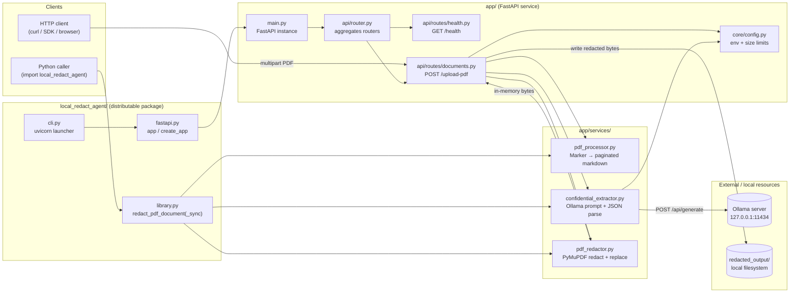
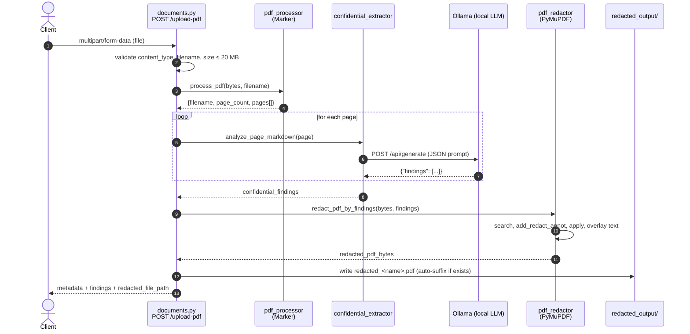

# Redactora Architecture

This document describes the runtime architecture of Redactora: the entry points, internal modules, and the external resources it depends on. All processing is local-first — the only network call leaves the process to a locally running Ollama server.

## High-level component diagram



### Layers

- **Entry points (`local_redact_agent/`)** — the published package exposes three ways to use Redactora:
  - `cli.py` runs `uvicorn` against the FastAPI app (used by the `redactora` console script).
  - `fastapi.py` re-exports the FastAPI `app` and a `create_app()` factory for ASGI servers.
  - `library.py` provides `redact_pdf_document` / `redact_pdf_document_sync` for programmatic use without HTTP.
- **HTTP surface (`app/api/`)** — a thin FastAPI router layer:
  - `GET /health` — liveness probe.
  - `POST /upload-pdf` — single endpoint that runs the full pipeline and returns metadata plus the saved redacted file path.
- **Services (`app/services/`)** — stateless, pure-Python modules that own one responsibility each:
  - `pdf_processor` wraps the Marker PDF → markdown converter with a `lru_cache(maxsize=1)` so models are loaded once per process, and splits the output into `{page_number, markdown}` records.
  - `confidential_extractor` builds a JSON-schema-oriented prompt per page, calls Ollama's `/api/generate`, and normalizes the findings.
  - `pdf_redactor` uses PyMuPDF (`fitz`) to locate each extracted value on its original page, apply redaction annotations, and overlay a type-appropriate surrogate (e.g. dummy email, address, id) with matched font size.
- **Configuration (`app/core/config.py`)** — centralizes env-driven settings (`OLLAMA_BASE_URL`, `OLLAMA_MODEL`, `OLLAMA_TIMEOUT_SECONDS`, `REDACTED_OUTPUT_DIR`) and the 20 MB upload limit.

## Request flow — `POST /upload-pdf`



### Error surface

| Stage | Failure | HTTP status |
| --- | --- | --- |
| Upload validation | Wrong MIME type, missing filename, empty, > 20 MB | `400` |
| PDF → markdown (Marker) | Parse failure | `400` |
| Ollama extraction | Network/model failure | `502` |
| PDF redaction (PyMuPDF) | Unexpected failure | `500` |

## Data contract

The endpoint returns a single JSON object that mirrors the internal pipeline stages:

```json
{
  "filename": "example.pdf",
  "page_count": 2,
  "pages": [{ "page_number": 1, "markdown": "..." }],
  "confidential_findings": [
    {
      "page_number": 1,
      "findings": [
        { "type": "email", "value": "...", "reason": "...", "confidence": 0.95 }
      ]
    }
  ],
  "redacted_filename": "redacted_example.pdf",
  "redacted_file_path": "/abs/path/redacted_output/redacted_example.pdf"
}
```

## Design notes

- **In-memory processing.** Uploaded bytes never touch disk; only the final redacted PDF is written to `REDACTED_OUTPUT_DIR`.
- **Single canonical pipeline.** Both the HTTP route (`documents.py`) and the library entry point (`library.py`) call the same three services in the same order, so behavior is consistent across transports.
- **Deterministic output path.** `_resolve_output_path` preserves the original filename under a `redacted_` prefix and auto-suffixes (`_1`, `_2`, ...) to avoid overwriting prior runs.
- **Local-only network.** The only outbound HTTP traffic is to `OLLAMA_BASE_URL` (defaults to loopback).
- **Model cache.** Marker's model dict is built once per process via `lru_cache`; the first request pays the warm-up cost.
